<div align="center">


<h1>Azure Virtual Desktop (AVD) Onboarding Accelerator</h1>

<p><strong>Rapid Workforce Provisioning, Identity Integration & Automated Workspace Readiness</strong></p>

[](https://devopstrio.co.uk/)
[](https://devopstrio.co.uk/)
[](https://devopstrio.co.uk/)
[](/apps/workflow-engine)

</div>

---

## 🏛️ Executive Summary

The **AVD Onboarding Accelerator** is a flagship enterprise platform designed to eliminate the friction from scaling the digital workplace. In large organizations, onboarding a new department, an acquired subsidiary, or thousands of seasonal contractors can take weeks of manual identity mapping, server provisioning, and security configuration. This accelerator reduces that lead time to minutes through an automated, "zero-touch" orchestration layer.

By coupling a self-service intake portal with high-performance **Workflow Engines**, the platform automates the entire user lifecycle—from Entra ID group membership and license assignment to the dynamic provisioning of host pools and application groups. It ensures that every new user or business unit is onboarded within corporate governance guardrails, with the correct regional placement and security posture enabled by default on day one.

### Strategic Business Outcomes
- **Accelerated Time-to-Market**: Rapidly deploy virtual workspaces for new teams or expansion regions without manual administrator intervention.
- **Seamless M&A Integration**: Provide a plug-and-play migration path for acquired entities, normalizing their workforce into the corporate AVD ecosystem via automated templates.
- **Reduced Operational Overhead**: Eliminate repetitive provisioning tasks through codified "Workplace Blueprints" and self-healing identity synchronization.
- **Enhanced User Experience**: Ensure users have immediate access to their business-critical applications from the first login, with automated FSLogix profile readiness.

---

## 🏗️ Technical Architecture Details

### 1. High-Level Onboarding Architecture
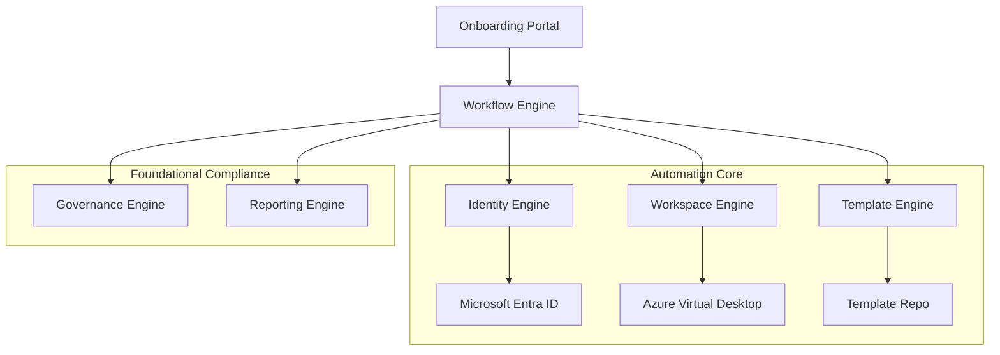

### 2. Onboarding Request Workflow
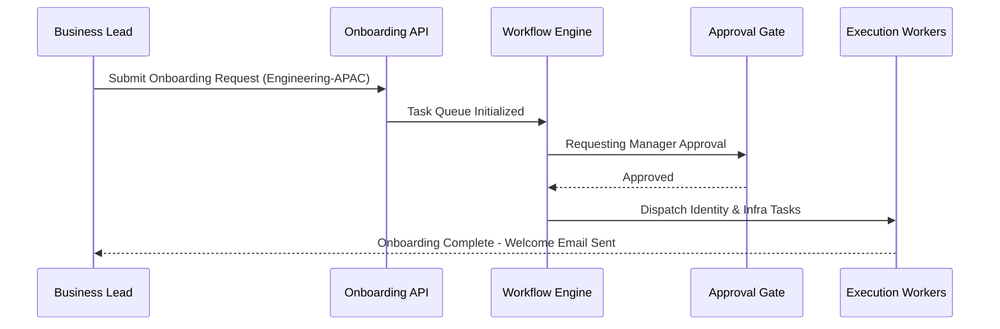

### 3. User Provisioning Lifecycle
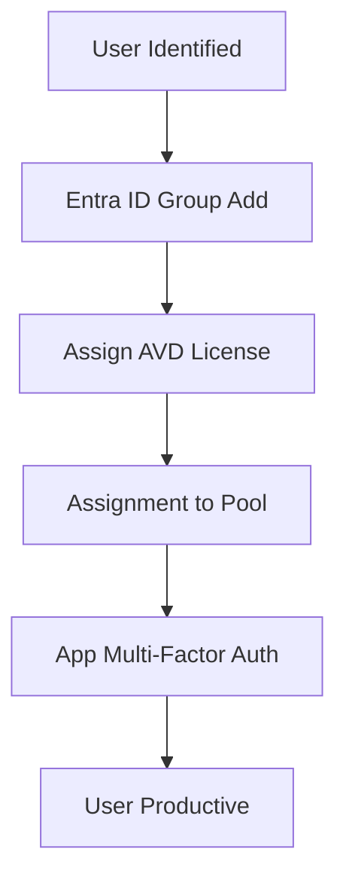

### 4. Template Deployment Flow
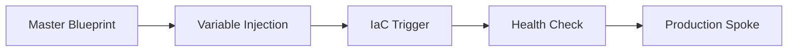

### 5. Identity Sync Workflow
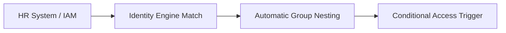

### 6. Security Trust Boundary
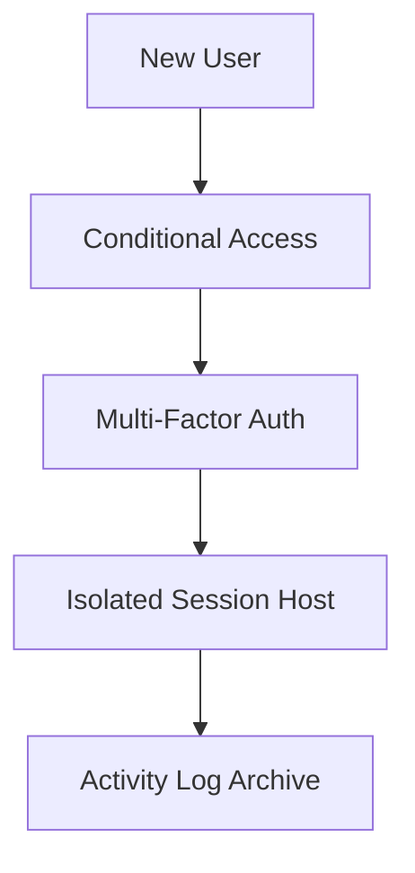

### 7. AVD Enterprise Topology
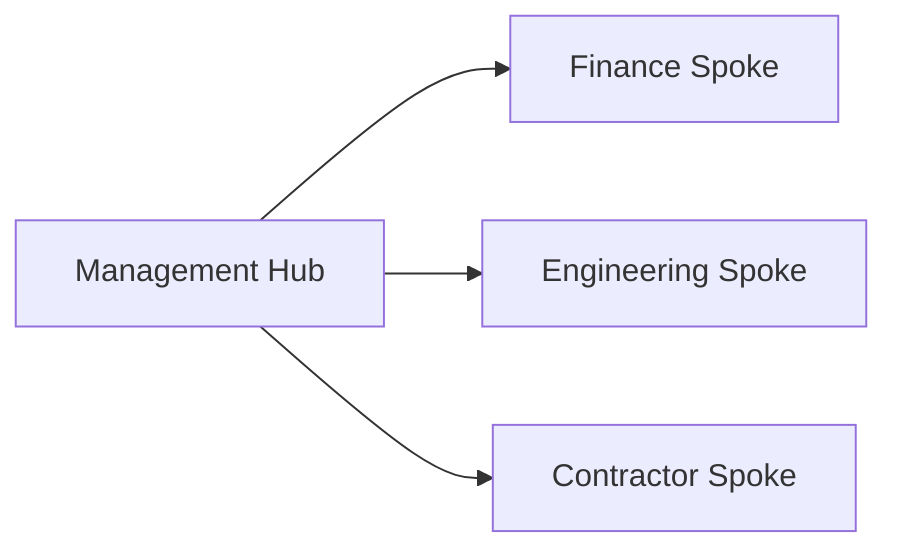

### 8. API Request Lifecycle
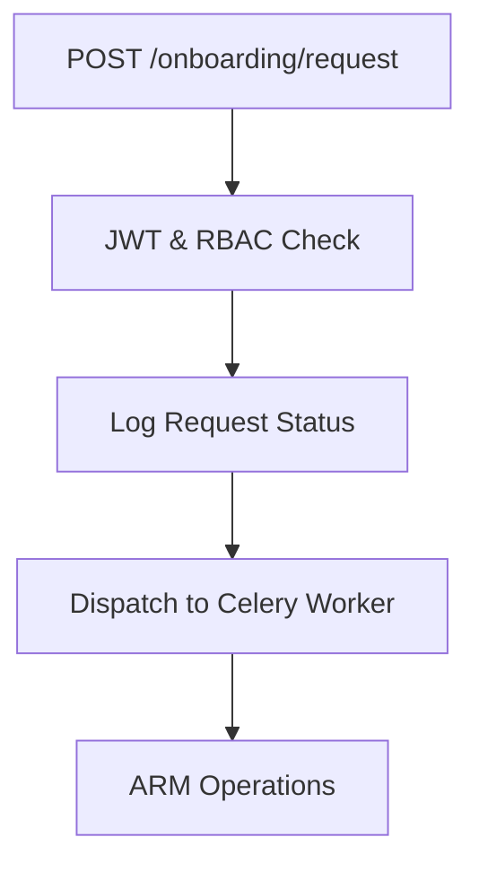

### 9. Multi-Tenant Tenancy Model
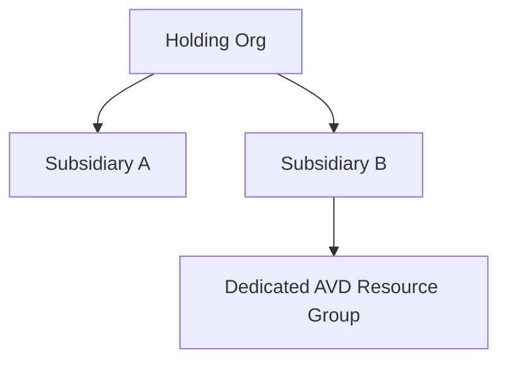

### 10. Monitoring & Telemetry Flow
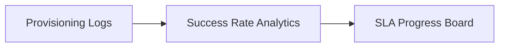

### 11. Disaster Recovery Topology
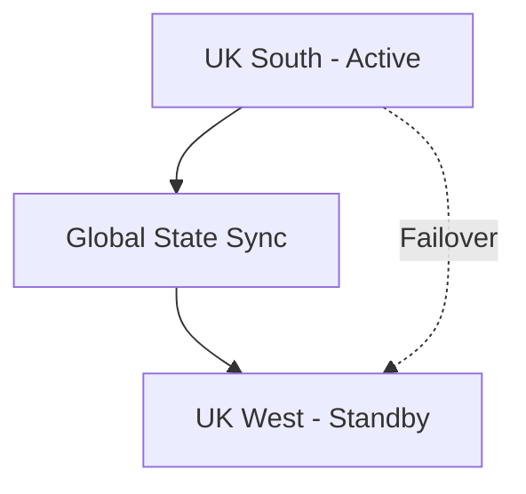

### 12. M&A Migration Workflow
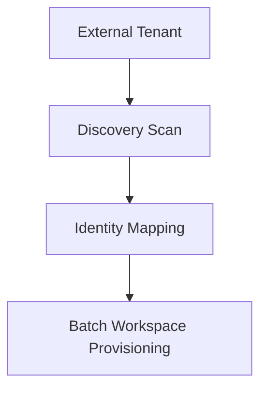

### 13. License Assignment Flow
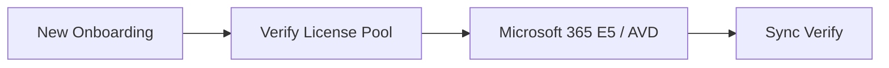

### 14. CI/CD Infrastructure Pipeline
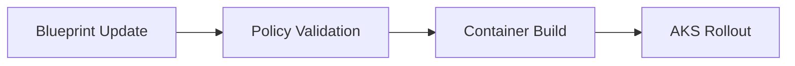

### 15. Executive Governance Workflow
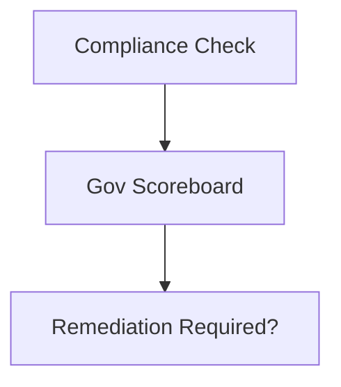

### 16. Region Expansion Model
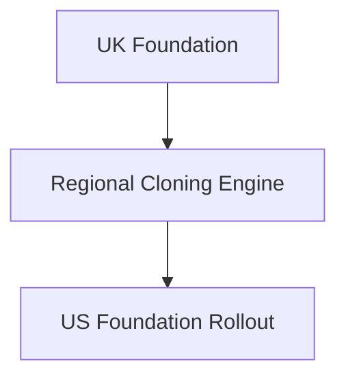

### 17. Contractor Access Lifecycle
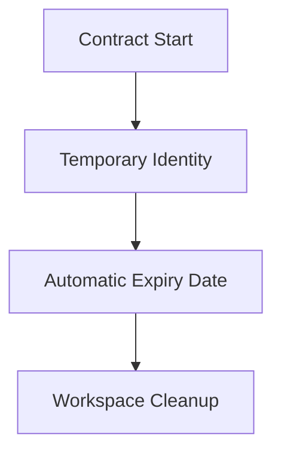

### 18. Capacity Allocation Workflow
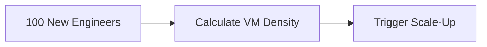

### 19. Global Region Topology
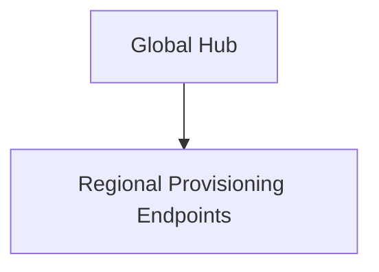

### 20. Drift Remediation Flow
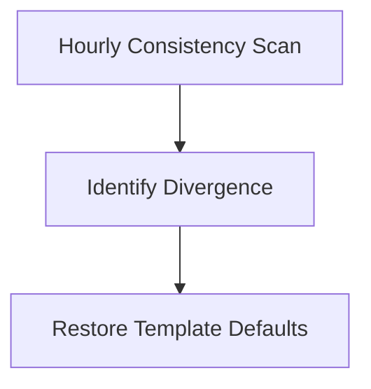

---

## 🚀 Deployment Guide

### Terraform Orchestration
```bash
cd terraform/environments/prd
terraform init
terraform apply -auto-approve
```

---
<sub>&copy; 2026 Devopstrio &mdash; Engineering the Hyper-Growth Foundation for the Global Digital Workplace.</sub>
