<div align="center">


<h1>AVD Onboarding Accelerator</h1>

<p><strong>The Institutional-Grade Platform for Standardized Workforce foundations, Onboarding Governance, and Multi-Cloud EUC Ecosystems.</strong></p>

[]()
[]()
[]()

<br/>

> **"Industrializing workforce onboarding to automate digital workplace foundations."** 
> **AVD Onboarding Accelerator** is an enterprise-grade platform designed to provide a secure, measurable, and highly automated foundation for global virtual desktop operations. It orchestrates the complex lifecycle of user onboarding—from automated identity provisioning and multi-cloud workspace reconciliation to high-throughput workflow intelligence and unified EUC auditing.

</div>

---

## 🏛️ Executive Summary

Fragmented identity mapping and manual workspace orchestration are strategic operational liabilities; lack of a standardized onboarding framework is a primary barrier to organizational engineering maturity. Organizations fail to scale their virtual desktops not because of a lack of compute, but because of fragmented evaluation standards, lack of automated workspace reconciliation, and an inability to orchestrate onboarding planes with operational precision.

This platform provides the **Onboarding Intelligence Plane**. It implements a complete **AVD-Onboarding-Accelerator-as-Code Framework**, enabling CTOs and EUC Architects to manage global workforce foundations as first-class citizens. By automating the identification of onboarding regressions through real-time telemetry analysis and orchestrating the provisioning of secure performance-driven workspace policies, we ensure that every organizational user—from core employees to edge M&A subsidiaries—is provisioned by default, audited for history, and strictly aligned with institutional EUC frameworks.

---

## 📐 Architecture Storytelling: Principal Reference Models

### 1. Principal Architecture: Global Onboarding Factory & Intelligence Plane
This diagram illustrates the high-level relationship between the Intake Portal, the Workflow Engine, and the underlying Automation Core (Entra ID, AVD). It defines the bridge between business requests and the virtual workplace substrate.

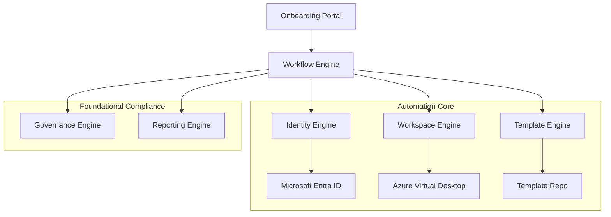

### 2. The Onboarding Lifecycle Flow (Intake & Provisioning)
The continuous path of a user onboarding from initial request submission and manager approval to identity synchronization and contractor access expiry. This ensures zero-interruption operations through dependency-aware onboarding flows.

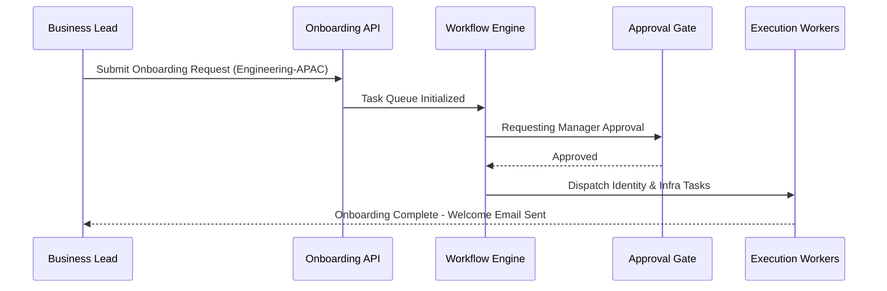

**User Provisioning Lifecycle:**
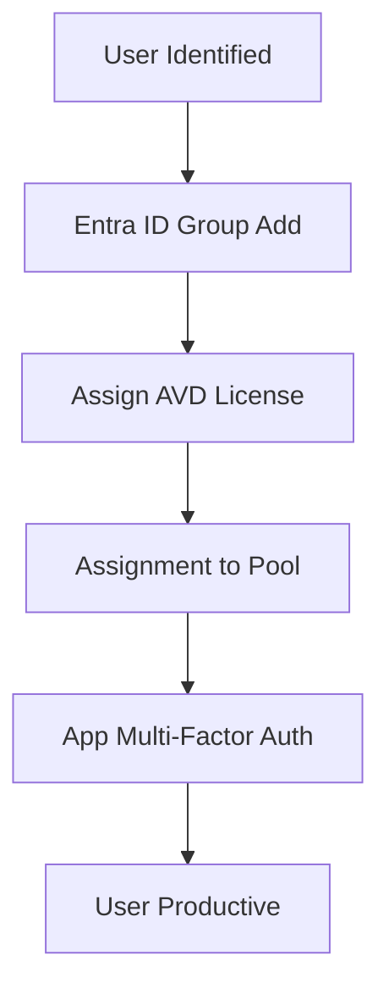

**Contractor Access Lifecycle:**
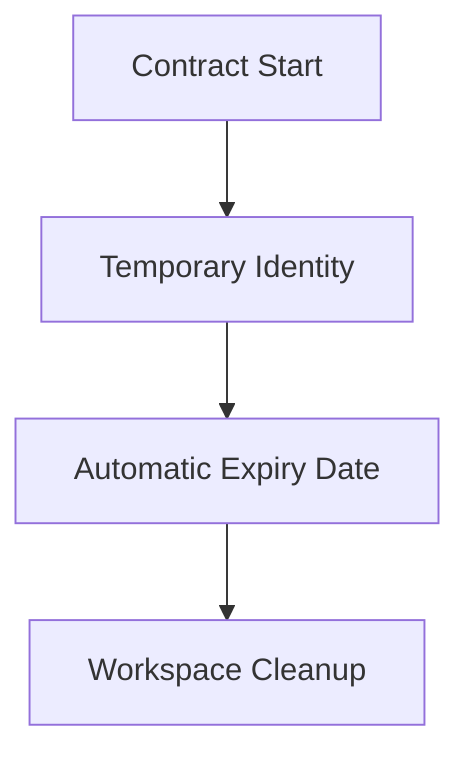

**M&A Migration Workflow:**
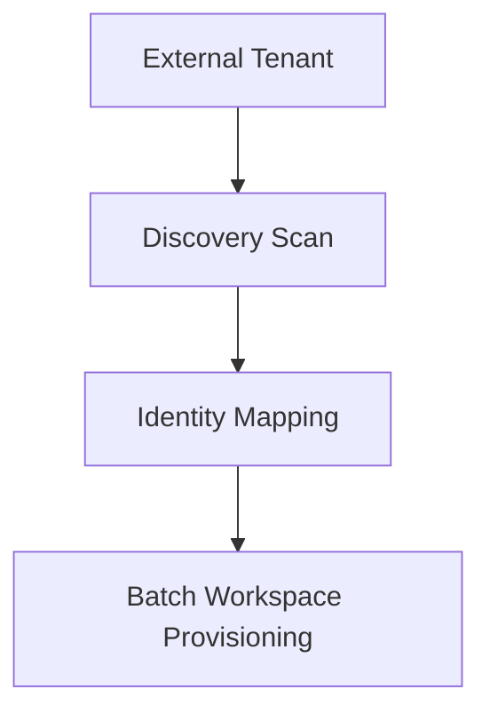

### 3. Distributed Onboarding Topology (Global Hub & Spokes)
Strategically orchestrating standardized onboarding across global regions and multi-tenant departments, providing a unified institutional view of workforce readiness.

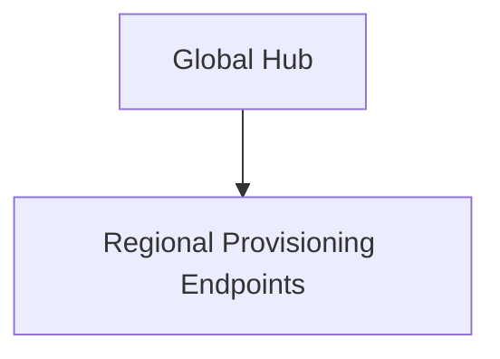

**AVD Enterprise Topology:**
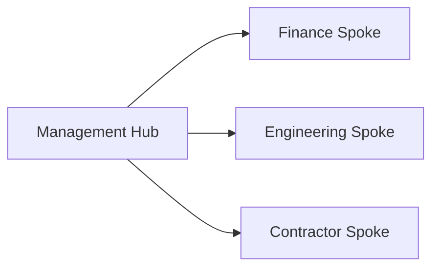

### 4. Governance Hub & Control Plane Flow
Executing complex logic for securing the bridge between onboarding requests and Azure resources, ensuring every task is authorized, licenses are assigned, and executive oversight is maintained.

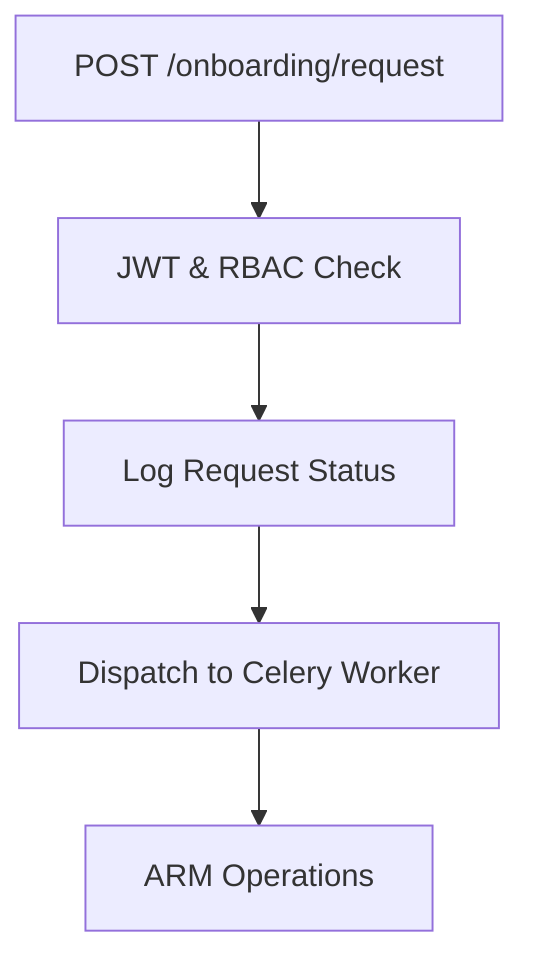

**License Assignment Flow:**
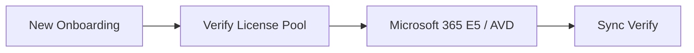

**Capacity Allocation Workflow:**
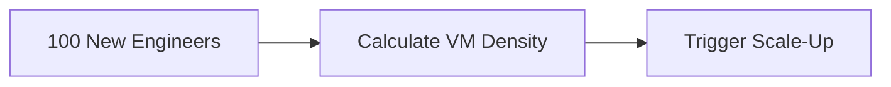

**Executive Governance Workflow:**
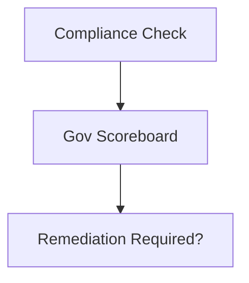

### 5. Multi-Cloud Onboarding Federation & Global Topology
Automatically managing unified onboarding standards across diverse cloud tenants and global regions, ensuring institutional data residency and privacy boundaries by default.

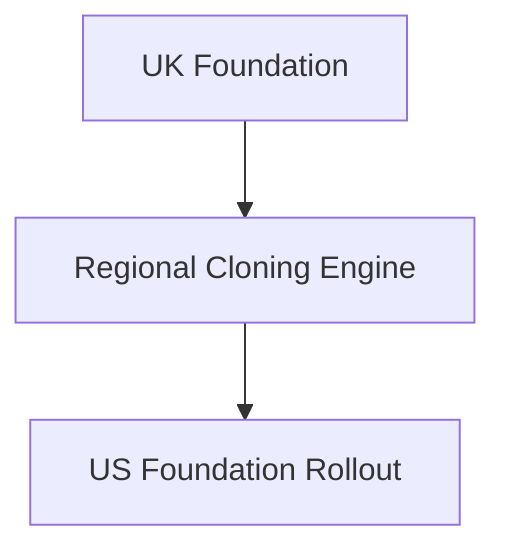

### 6. Encryption & Perimeter Protection Flow (Security Trust Boundary)
Managing the lifecycle of an onboarding request, automatically enforcing institutional Conditional Access and MFA standards as required by security policy, ensuring zero-latency security confidence.

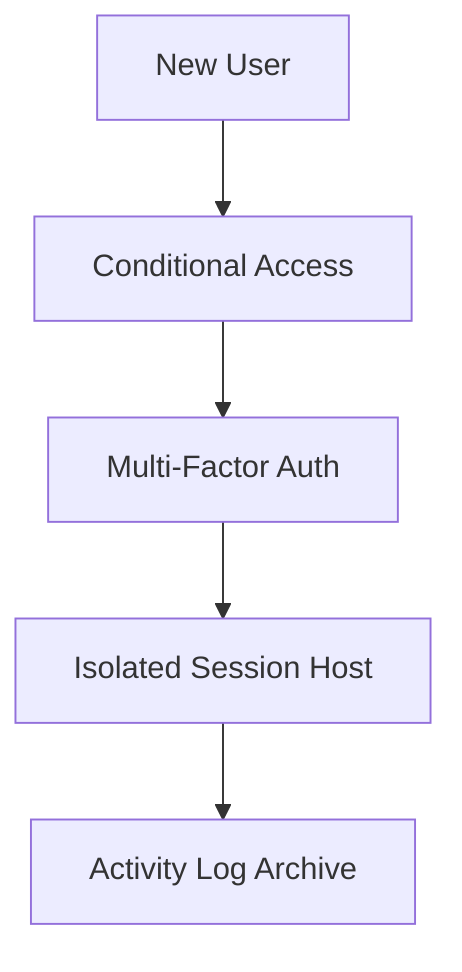

### 7. Institutional Onboarding Maturity Scorecard (Analytics Dashboard)
Grading organizational performance based on key indicators: Onboarding Lead Time, Provisioning Success Rate, and SLA Progress BOARD.

### 8. Identity & RBAC for Onboarding Governance
Managing fine-grained access to onboarding hubs, provisioning workers, and audit logs between Global Holding Corporations and Subsidiary tenants.

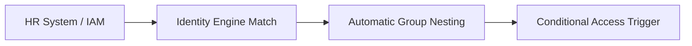

**Multi-Tenant Tenancy Model:**
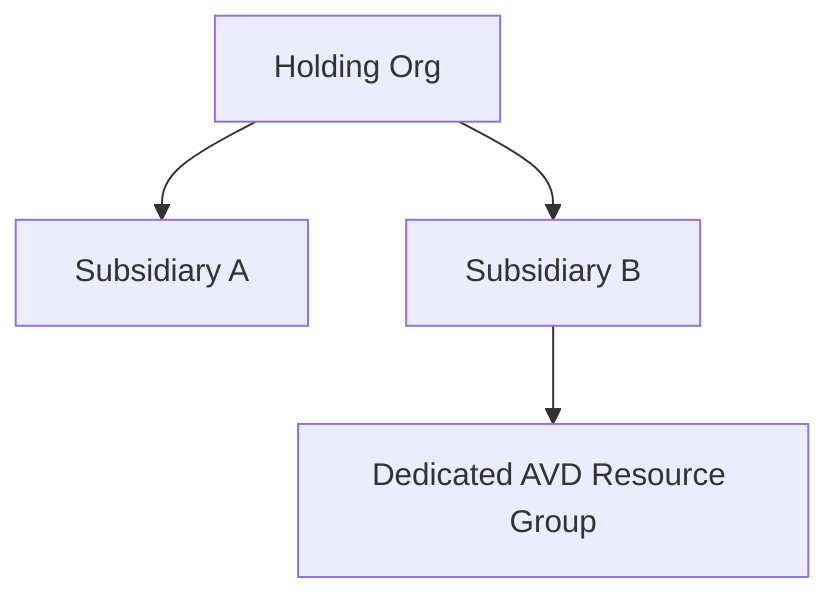

### 9. IaC Deployment: AVD-Onboarding-Accelerator-as-Code Framework
Using modular CI/CD pipelines to deploy and manage the versioned distribution of the workplace blueprints, onboarding templates, and validation fleets.

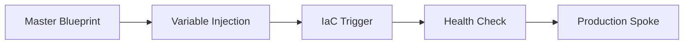

**CI/CD Infrastructure Pipeline:**
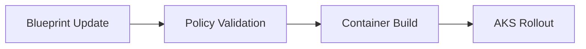

### 10. AIOps Onboarding Drift & Risk Validation Flow
Using advanced analytics to identify sudden surges in provisioning failures, unauthorized workspace changes, or unusual delivery pattern changes that could result in institutional risk or downtime.

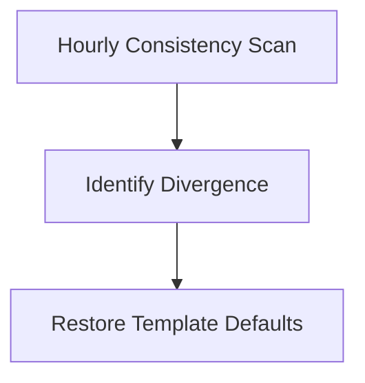

**Disaster Recovery Topology:**
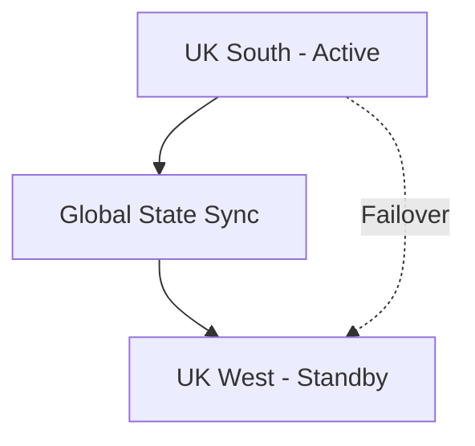

### 11. Metadata Lake for Forensic Onboarding Audit
Storing long-term records of every onboarding integration event (metadata), every identity synced, and every provisioning telemetry for institutional record-keeping and forensic analysis.

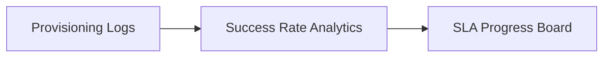

---

## 🏛️ Core Governance Pillars

1.  **Unified Foundation Coordination**: Maximizing resilience by centralizing all onboarding measurement through a single institutional plane.
2.  **Automated Workspace Provisioning**: Eliminating "manual tracking" scenarios through proactive orchestration and pattern verification.
3.  **Sequential Onboarding Intelligence**: Ensuring zero-interruption operations through dependency-aware onboarding-driven data engineering.
4.  **Zero-Trust Identity Protection**: Automatically enforcing identity-based access, MFA encryption, and policy evaluation across all assurance tiers.
5.  **Autonomous Operations Logic**: Guaranteeing reliability through automated industry-specific effectiveness monitoring runbooks.
6.  **Full Onboarding Auditability**: Immutable recording of every identity change and onboarding provision for institutional forensics.

---

## 🛠️ Technical Stack & Implementation

### Onboarding Engine & APIs
*   **Framework**: Python 3.11+ / FastAPI.
*   **Performance Engine**: Custom Python-based logic for multi-cloud workspace reconciliation and DORA-style EUC metrics.
*   **Integrations**: Native connectors for Entra ID, AVD, and corporate HR systems.
*   **Persistence**: PostgreSQL (Onboarding Ledger) and Redis (Live Provisioning State).
*   **Auth Orchestrator**: Federated OIDC/SAML for least-privilege onboarding management access.

### Governance Dashboard (UI)
*   **Framework**: React 18 / Vite.
*   **Theme**: Dark, Slate, Indigo (Modern high-fidelity productivity aesthetic).
*   **Visualization**: D3.js for delivery topologies and Recharts for ROI velocity analytics.

### Infrastructure & DevOps
*   **Runtime**: AWS EKS or Azure Kubernetes Service (AKS) for management plane.
*   **Measurement Hub**: Managed event sourcing for immutable productivity timeline reconstruction.
*   **IaC**: Modular Terraform for deploying the onboarding landing zone and validation fleet.

---

## 🏗️ IaC Mapping (Module Structure)

| Module | Purpose | Real Services |
| :--- | :--- | :--- |
| **`infrastructure/onboarding_hub`** | Central management plane | EKS, PostgreSQL, Redis |
| **`infrastructure/enforcers`** | Distributed workspace provisioners | Azure, AWS, GCP APIs |
| **`infrastructure/onboarding_pipes`** | Data Ingestion Hubs | Webhooks, Lambda |
| **`infrastructure/auditing`** | Forensic modernization sinks | S3, Athena, Quicksight |

---

## 🚀 Deployment Guide

### Local Principal Environment
```bash
# Clone the AVD Onboarding Accelerator repository
git clone https://github.com/devopstrio/avd-onboarding-accelerator.git
cd avd-onboarding-accelerator

# Configure environment
cp .env.example .env

# Launch the Onboarding stack
make init

# Trigger a mock onboarding update and automated guardrail validation simulation
make simulate-onboarding
```

Access the Management Portal at `http://localhost:3000`.

---

## 📜 License
Distributed under the MIT License. See `LICENSE` for more information.

---
<div align="center">
  <p>© 2026 Devopstrio. All rights reserved.</p>
</div>
